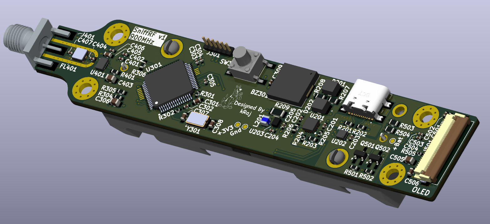
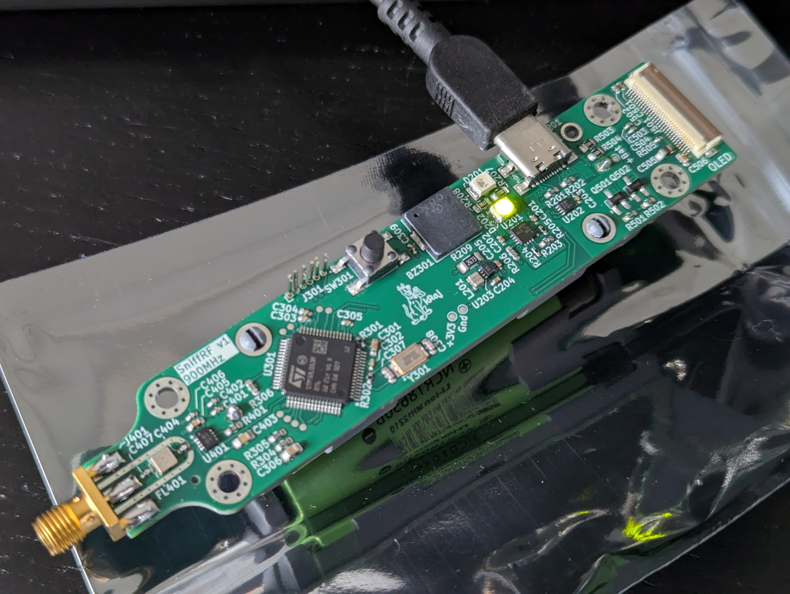
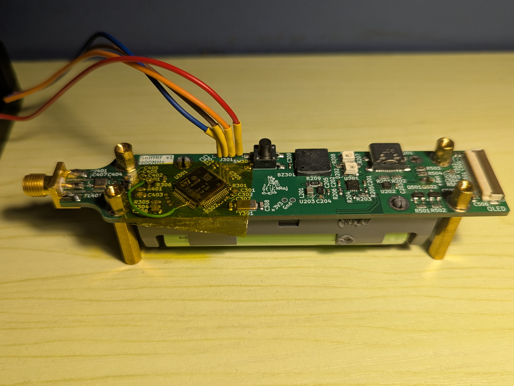

# sniffRF
  
  
  

## About
SniffRF is a simple RSSI detector aka a signal strength detector for the 902MHz to 928MHz band using an AD8318 logarithmic detector chip and built around an STM32L053R8 MCU. SniffRF displays the RSSI level on a mini OLED. SniffRF will also pulse a buzzer with varying frequency based on the RSSI level. 

## Sub-Systems
* RF: Input from SMA fed into AD8318 log detector.  
* MCU: STM32L053R8 M0+ interface circuitry, program/debug MCU via SWD.
* UI: OLED for visual feedback and buzzer for audio feedback.
* Power: 1x 18650 cell with BQ24074 power path manager, charge via USB-C, MAX1704 fuel gauge, simple buck converter for 3.3V

## Application
* SniffRF could be used to track RF transmitters using their radio signature.  
* SniffRF could also be used to gauge the noise floor at a particular location to select or deploy a receiver at said location.     

*Note: As of now, SniffRF only tunes into the 902-928MHz band.*

## Bring Up and Validation
* STM32 MCU able to boot up and connect via J-Link debugger to STM32CubeIDE. STM32 UART connection working as expected.  
* AD8318 RSSI detection circuit is fully functional from about -60dBm to 0dBm. A known RF source (Sine wave transmitted at 915MHz from an Adalm Pluto SDR) was moved toward and away from the SniffRF PCB - this caused the RSSI readings to increase and decrease as expected.  
* Li-Ion battery power path manager is able to charge the 18650 battery when a USB-C charge cable is plugged in. MAX1704 fuel gauge is able to read Li-Ion battery voltage + capacity and send this data over to the STM32 for display over UART.  
* Buzzer interfaced to STM32 is functional.  

## Thoughts...
This is my first STM32 PCB! I made this PCB to learn STM32 design as well as try my hand at mixed signal PCB design. Feels good to finally strike this off my bucket list. Spent a few weekends working on this project over 3 months. More advanced RF PCBs to come!